# Copilot Studio Agent Flow Setup Guide

## Setup Steps

| Step | Description | Screenshot |
|------|-------------|------------|
| 1 | Open your Copilot Studio Environment. |  |
| 2 | Click on the **Flows** tab (left sidebar). | 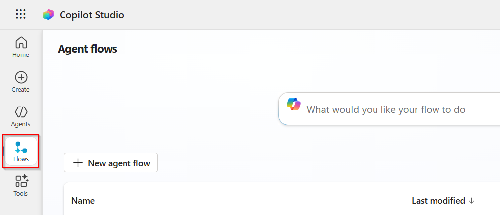 |
| 3 | Click on **New agent flow**. | 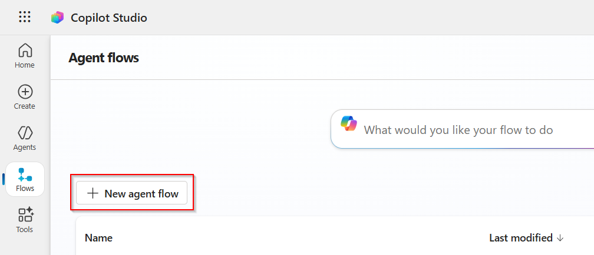 |
| 4 | Add the **When an agent calls the flow** trigger. Add an input for **User Query** as text. |  |
| 5 | Click on the Plus symbol under the **When an agent calls the flow** action. Search and add **Initialize Variable** actions for: - **Space-ID** (String): User needs to fill the Space ID of the Databricks Genie  - **Token** (String): User needs to fill the PAT Token of Databricks  - **Text Output** (String): Stores text output from Databricks Genie - initial value to be left empty  - **Inline Data** (Object): Stores query results for visualization - initial value to be left empty |  |
| 6 | Add an **HTTP** action from the HTTP subsection to send a **POST** request to the Databricks Genie API to start the conversation: - **URL:** `<Your Databricks endpoint>/api/2.0/genie/spaces/<Space-ID>/start-conversation` - **Header:** `Authorization: Bearer <Token variable>` - **Body:** JSON with `content: User Query` | 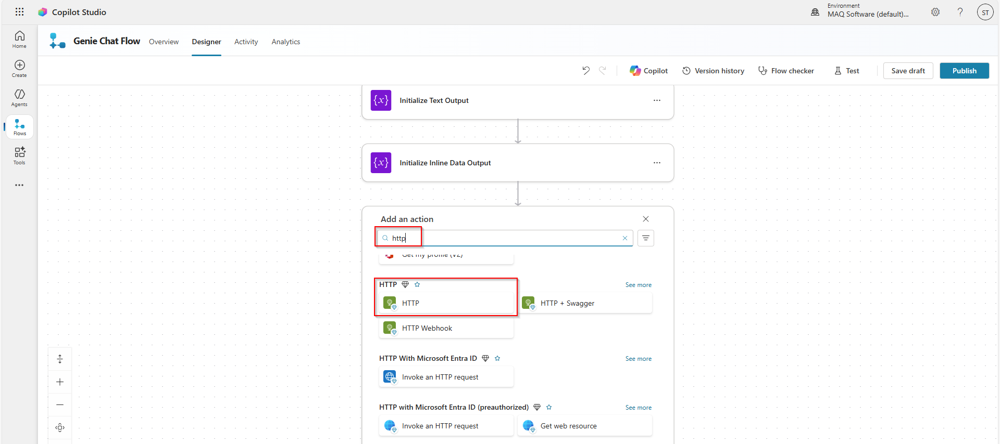 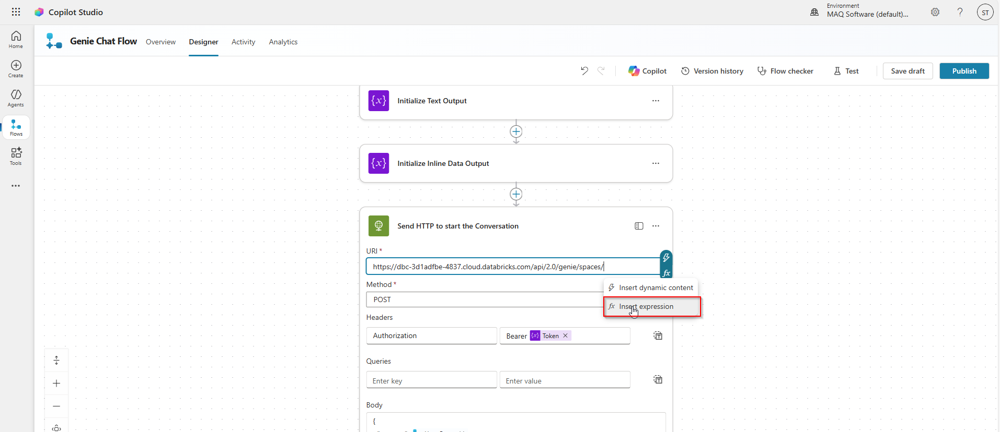 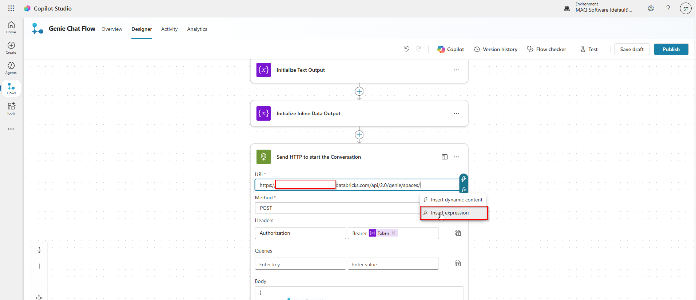  |
| 7 | Add an **HTTP** action to send a **GET** request to Databricks Genie API to get the status of the conversation message (use `conversation_id` and `message_id` from previous step): - **URL:** `<Your Databricks endpoint>/api/2.0/genie/spaces/<Space-ID>/conversations/<conversation_id>/messages/<message_id>` - **Header:** `Authorization: Bearer <Token variable>` |  |
| 8 | Add **Initialize Variable** action to store the status of the conversation message. | 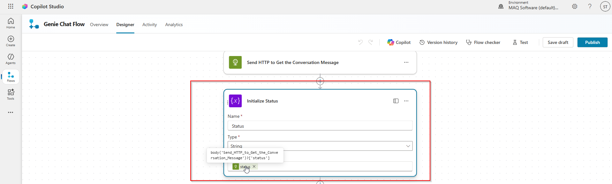 |
| 9 | Add an **HTTP** action to send a **GET** request to Databricks Genie API to get the status of the conversation message every 5 seconds until the status is **SUCCEEDED**:  &nbsp;&nbsp;&nbsp;1. Add a **Do until** action to check the status.  &nbsp;&nbsp;&nbsp;2. Inside the **Do until** action, add a **Delay** action (not **Delay until** action) to keep a delay of 5 seconds between the pings.  &nbsp;&nbsp;&nbsp;3. Add an **HTTP** action from the HTTP subsection to send the get request from the Genie Conversation API using the following details: &nbsp;&nbsp;&nbsp;&nbsp;&nbsp;&nbsp;- **URL:** `<Your Databricks endpoint>/api/2.0/genie/spaces/<Space-ID>/conversations/<conversation_id>/messages/<message_id>` &nbsp;&nbsp;&nbsp;&nbsp;&nbsp;&nbsp;- **Header:** `Authorization: Bearer <Token variable>` &nbsp;&nbsp;&nbsp;4. Add a **Set Variable** action to update the Status variable with the current value of HTTP action.  &nbsp;&nbsp;&nbsp;5. Update the until part with **Status** is equal to COMPLETED. | 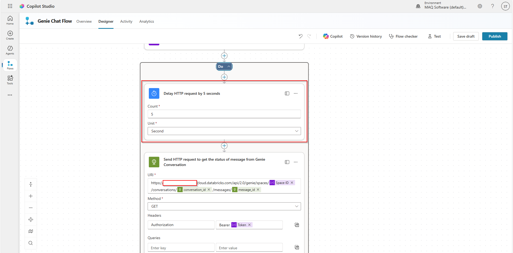   |
| 10 | Add an **HTTP** action to send a **GET** request to Databricks Genie API to get the message content: - **URL:** `<Your Databricks endpoint>/api/2.0/genie/spaces/<Space-ID>/conversations/<conversation_id>/messages/<message_id>` - **Header:** `Authorization: Bearer <Token variable>` |  |
| 11 | We get 2 types of message content from the Genie API: text and query. For simplicity, we are focusing only on the **text** part and will be just passing the **query** as is to the user.  &nbsp;&nbsp;&nbsp;1. Add an **Apply to each** action to iterate over the message contents fetched from the Databricks Genie API.  &nbsp;&nbsp;&nbsp;2. Add a **Compose** action for storing the result of the conditional statement as mentioned in the screenshot  &nbsp;&nbsp;&nbsp;3. Add a **Switch** action that checks the output of the previous Compose action.  &nbsp;&nbsp;&nbsp;&nbsp;&nbsp;&nbsp;- If the message content type is **text**, store it in the **Text Output** variable by adding an **Append variable** action.  &nbsp;&nbsp;&nbsp;&nbsp;&nbsp;&nbsp;- If the message content type is **query**, store it in the **Inline Data** variable by adding a **Set variable** action. |  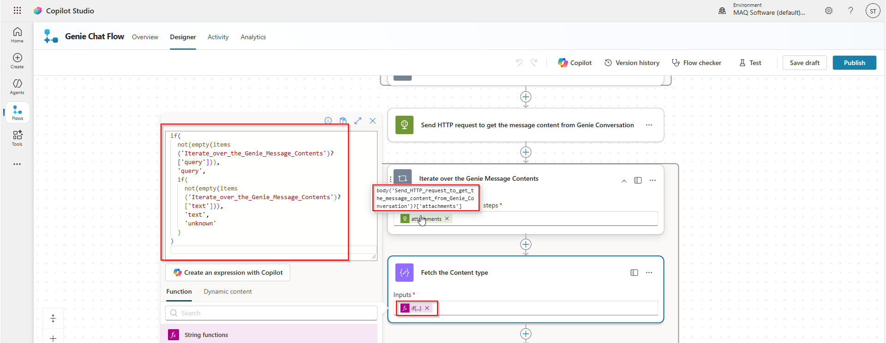  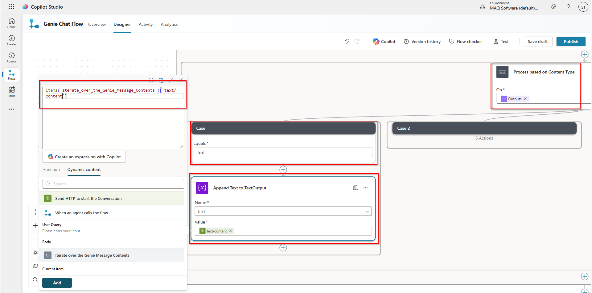 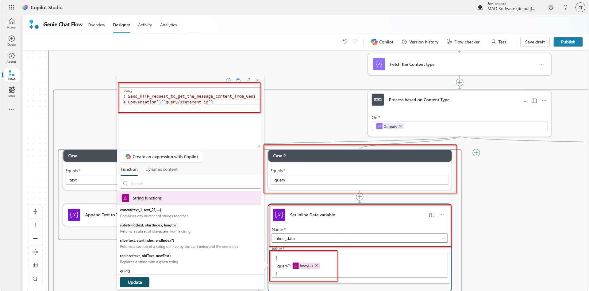 |
| 12 | Add a **Respond to the agent** action to respond with a structured JSON output to the Agent containing **User Query**, **Text Output**, and **Inline Data**. | 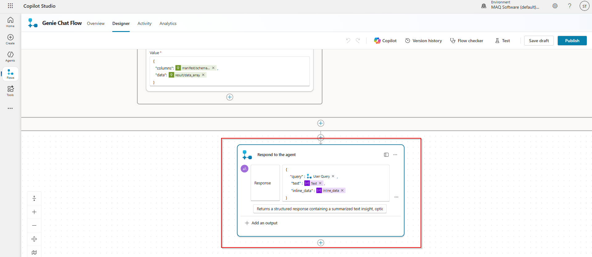 |
| 13 | Click on **Save draft** and then **Publish**. | 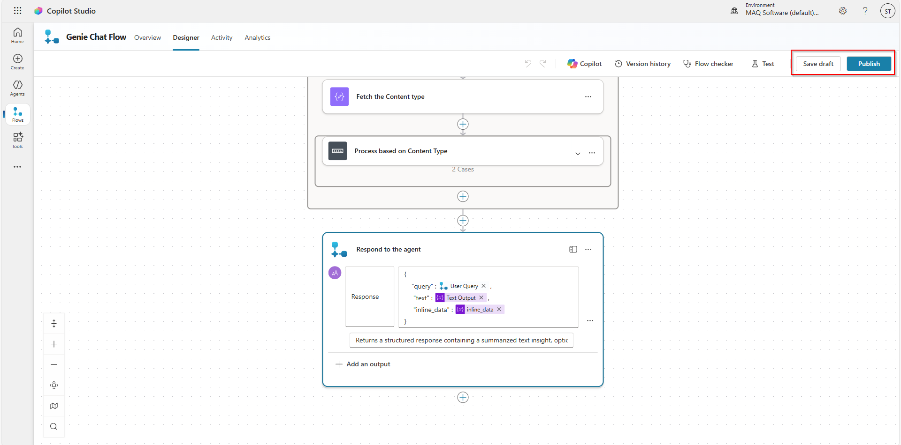 |

