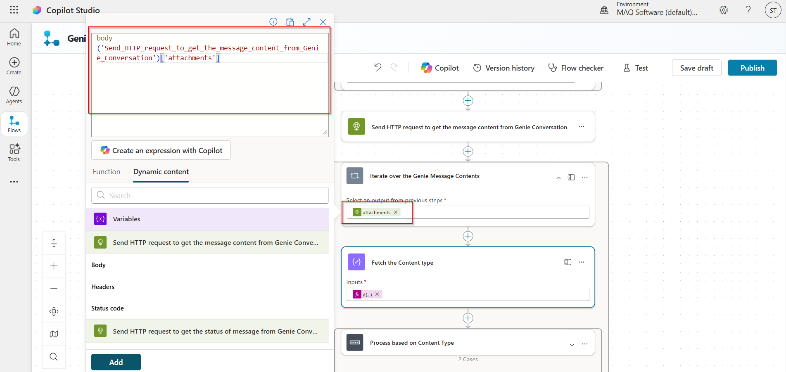
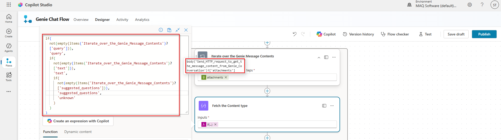
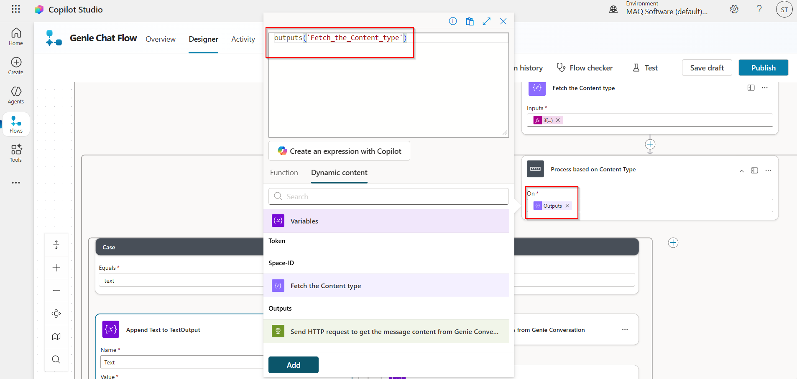

# Copilot Studio Agent Flow Setup Guide

## Setup Steps

| Step | Description | Screenshot |
|------|-------------|------------|
| 1 | Click on the **Flows** tab (left sidebar). |  |
| 2 | Click on **New agent flow**. |  |
| 3 | Add the **When an agent calls the flow** trigger. |  |
| 4 | Add **Initialize Variable** actions for: - **Space-ID** (User needs to fill the Space ID of the Databricks Genie) - **Token** (User needs to fill the PAT Token of Databricks) - **Text Output** (stores text output from Databricks Genie - initial value to be left empty) - **Inline Data** (stores query results for visualization - initial value to be left empty) |  |
| 5 | Add an action to send an HTTP **POST** request to the Databricks Genie API to start the conversation: - **URL:** `<Your Databricks endpoint>/api/2.0/genie/spaces/<Space-ID>/start-conversation` - **Header:** `Authorization: Bearer <Token variable>` - **Body:** JSON with `content: User Query` |   |
| 6 | Add an action to send an HTTP **GET** request to Databricks Genie API to get the status of the conversation message (use `conversation_id` and `message_id` from previous step): - **URL:** `<Your Databricks endpoint>/api/2.0/genie/spaces/<Space-ID>/conversations/<conversation_id>/messages/<message_id>` - **Header:** `Authorization: Bearer <Token variable>` |  |
| 7 | Add **Initialize Variable** action to store the status of the conversation message. |  |
| 8 | Add an action to send an HTTP **GET** request to Databricks Genie API to get the status of the conversation message every 5 seconds until the status is **SUCCEEDED** (add a Do until action to check the status): - **URL:** `<Your Databricks endpoint>/api/2.0/genie/spaces/<Space-ID>/conversations/<conversation_id>/messages/<message_id>` - **Header:** `Authorization: Bearer <Token variable>` |   |
| 9 | Add an action to send an HTTP **GET** request to Databricks Genie API to get the message content: - **URL:** `<Your Databricks endpoint>/api/2.0/genie/spaces/<Space-ID>/conversations/<conversation_id>/messages/<message_id>` - **Header:** `Authorization: Bearer <Token variable>` |  |
| 10 | Iterate over the message contents fetched from the Databricks Genie API by using an  **Apply to each** action (We get 2 types of message content from the Genie API: text and query. For simplicity, we are focusing only on the **text** part by using a **Switch** action.): - If the message content type is **text**, store it in the **Text Output** variable. |     |
| 11 | Respond with a structured JSON output to the Agent containing **User Query**, **Text Output**, and **Inline Data**. |  |
| 12 | Click on **Save draft** and then **Publish**. |  |

