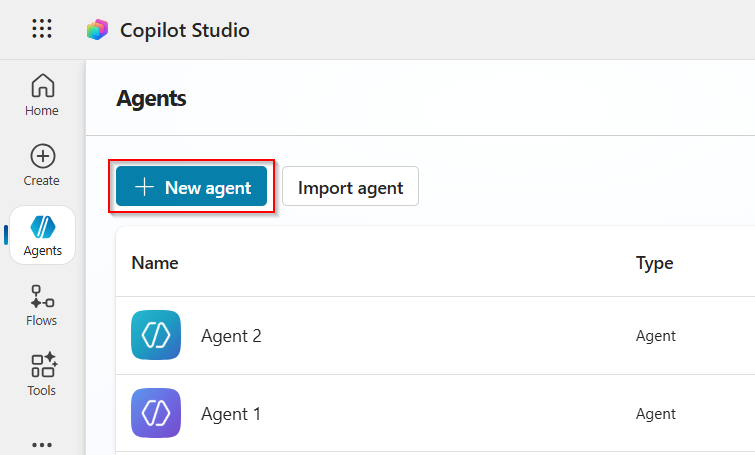
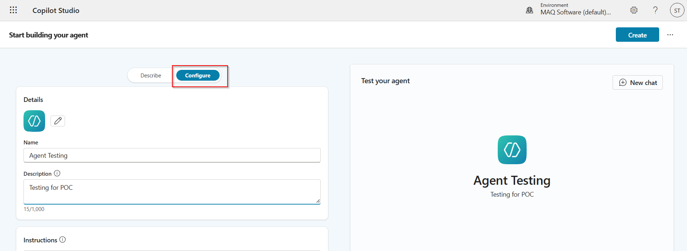
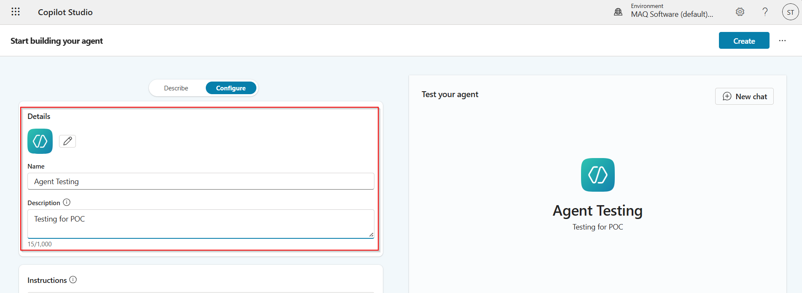
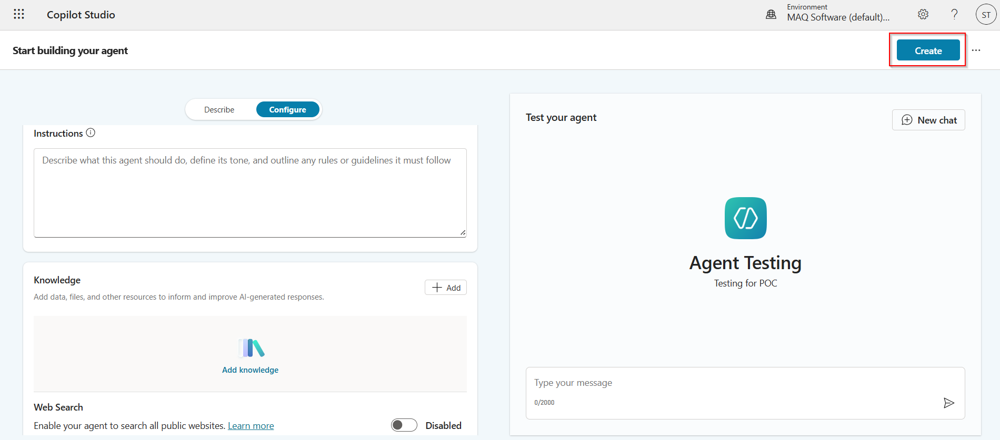
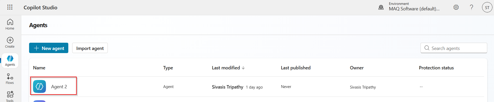
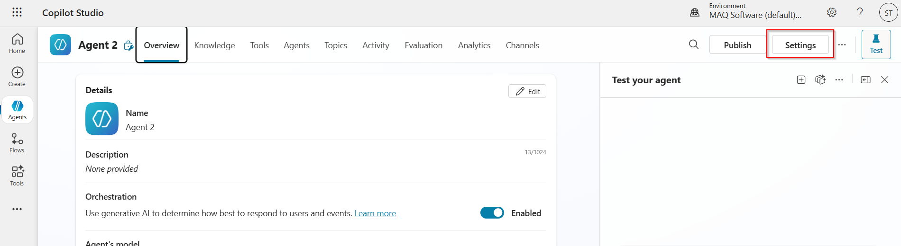
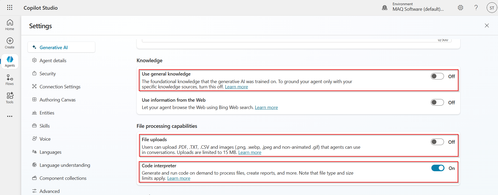
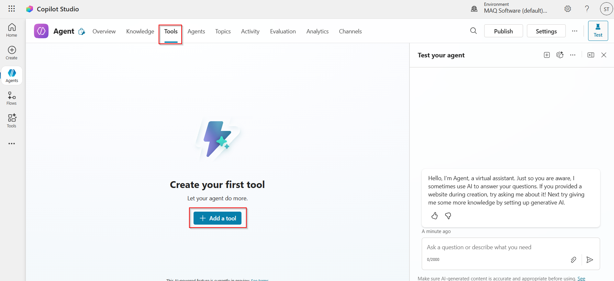
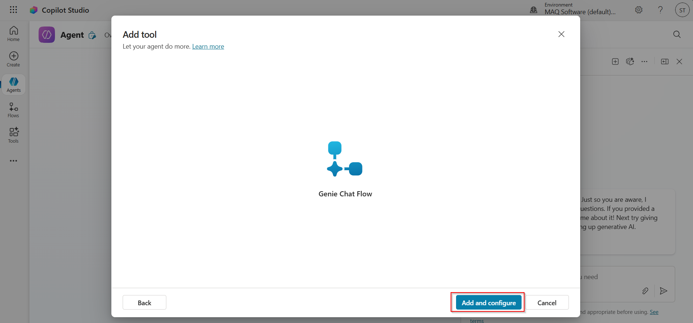

# Copilot Studio Agent Setup Guide

## 1. Create a New Agent

| Step | Description | Screenshot |
|------|-------------|------------|
| 1 | Open your Copilot Studio Environment. |  |
| 2 | Click on the **Agents** tab (left sidebar). |  |
| 3 | Click on the **New agent** button. |  |
| 4 | Go to the **Configure** tab. |  |
| 5 | Provide the name, logo, and description of the agent in the respective fields. |  |
| 6 | Add instructions for the agent and disable web search. |  |
| 7 | Click on **Create**. |  |

## 2. Update Settings

| Step | Description | Screenshot |
|------|-------------|------------|
| 1 | Select the newly created agent on the Agent page. |  |
| 2 | Click on the **Settings** button (top left corner). |  |
| 3 | In the **Generative AI** tab:   - Turn off **Use general knowledge**   - Turn off **File uploads**   - Turn on **Code interpreter** |  |

## 3. Add Tool

| Step | Description | Screenshot |
|------|-------------|------------|
| 1 | Select the newly created agent on the Agent page. |  |
| 2 | Click on the **Tools** tab, click on **Add a tool** button, then the **Flow** tab. |   |
| 3 | Click on the Agent flow you want to add, then click **Add and configure**. |  |
| 4 | Ensure the flow is **Enabled** and click **Save**. |  |
