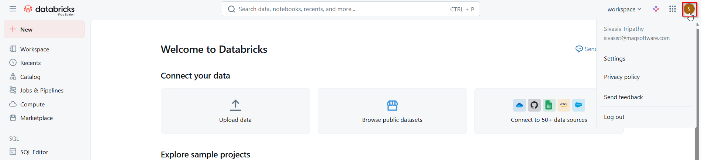
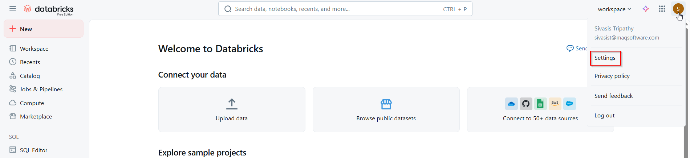
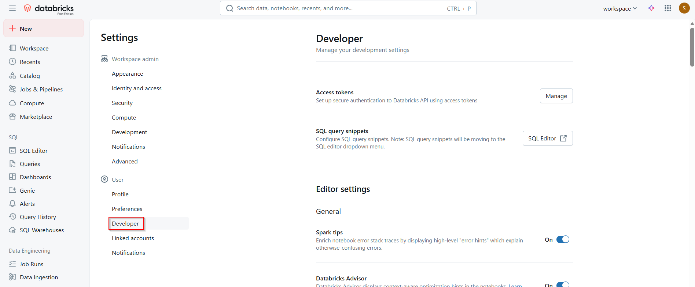
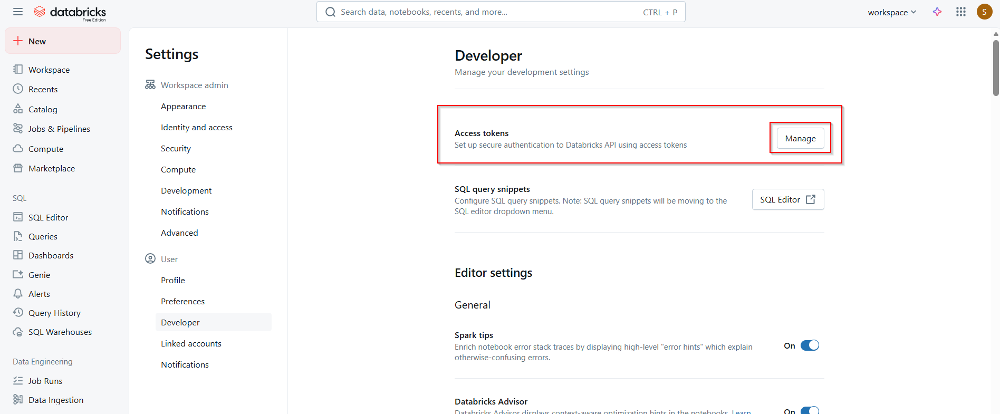
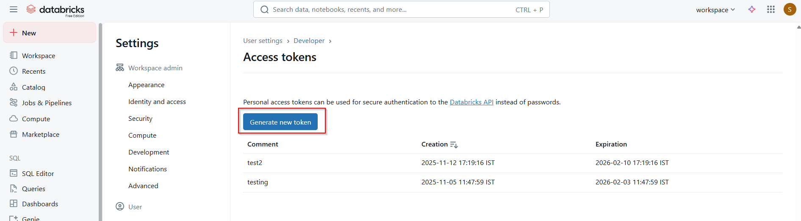
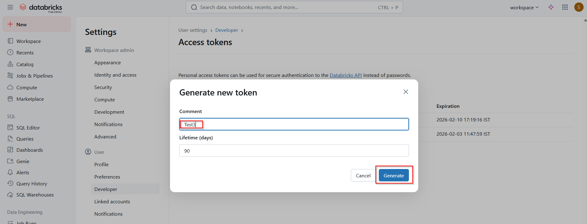
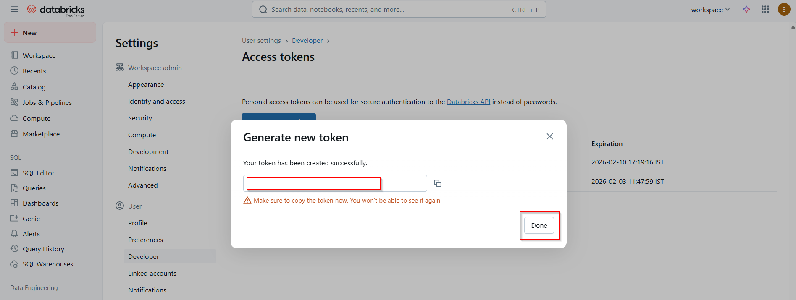
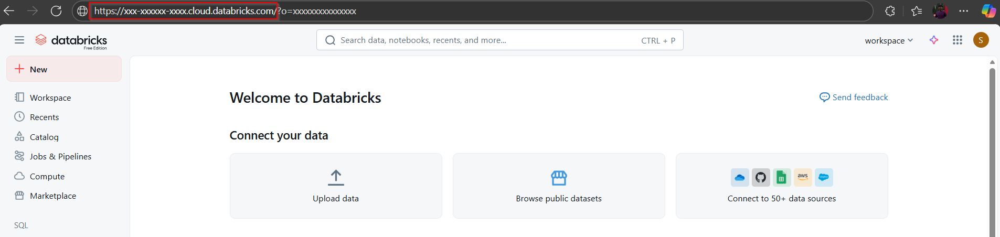
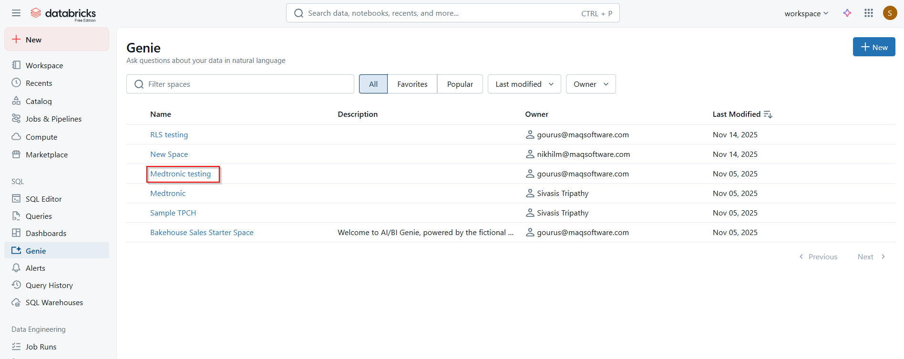
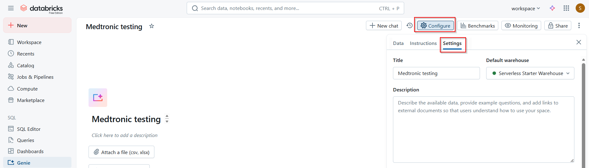

# Databricks Genie Setup Guide

## 1. Get the PAT Token

| Step | Description | Screenshot |
|------|-------------|------------|
| 1 | Open your Databricks workspace. |  |
| 2 | Click on your **Profile** (top left corner). |  |
| 3 | Click on **Settings**. |  |
| 4 | Click on **Developer** under the User tab. |  |
| 5 | Click on **Manage** for Access Token. |  |
| 6 | Click on **Generate new token**. |  |
| 7 | Provide a comment for the token, set the validity if required, and click **Generate**. |  |
| 8 | Copy the token and click **Done**. |  |

## 2. Get the Endpoint

| Step | Description | Screenshot |
|------|-------------|------------|
| 1 | Open your Databricks workspace. |  |
| 2 | Copy the page URL (e.g., `https://xxx-xxxxx-xxxx.cloud.databricks.com/browse?o=xxxxxxxxxx`). |  |
| 3 | Your Databricks endpoint is: `https://xxx-xxxxx-xxxx.cloud.databricks.com` |  |

## 3. Get the Space ID

| Step | Description | Screenshot |
|------|-------------|------------|
| 1 | Click on the **Genie** tab (left sidebar). |  |
| 2 | Click on the particular Genie. |  |
| 3 | Click on **Configure** and go to the **Settings** tab. |  |
| 4 | Copy your Genie Space ID. |  |
