# Integration and Publish to Teams Guide

## Integration

| Step | Description | Screenshot |
|------|-------------|------------|
| 1 | Once the flow has been created, add it as a tool to the Agent. |   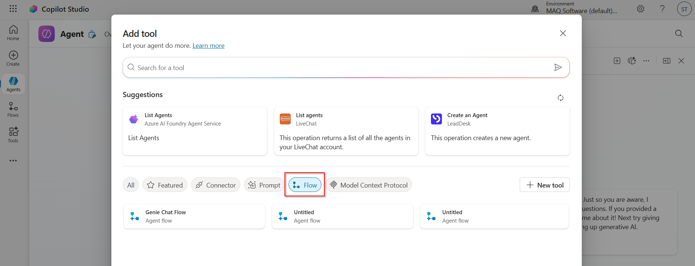  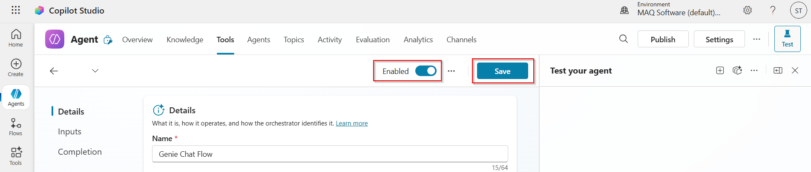 |
| 2 | After adding, click on the flow. Go to the **User Query** under the Inputs tab. Update the Fill using to **Custom Value** and Value to **LastMessage.Text**. Make sure that the flow is enabled and click on **Save**. | 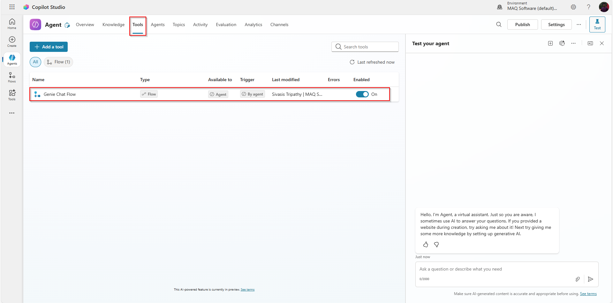 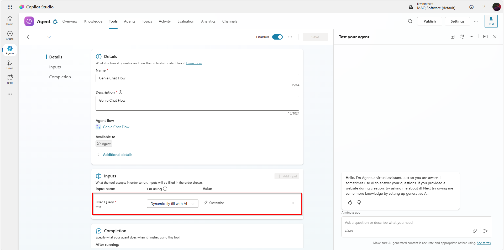 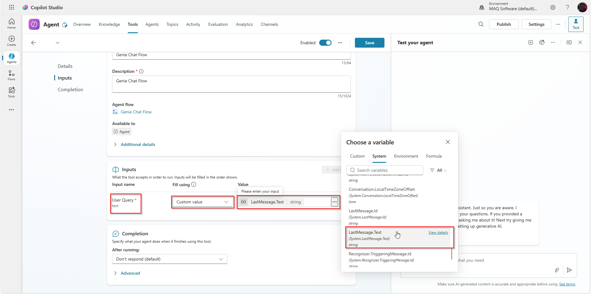 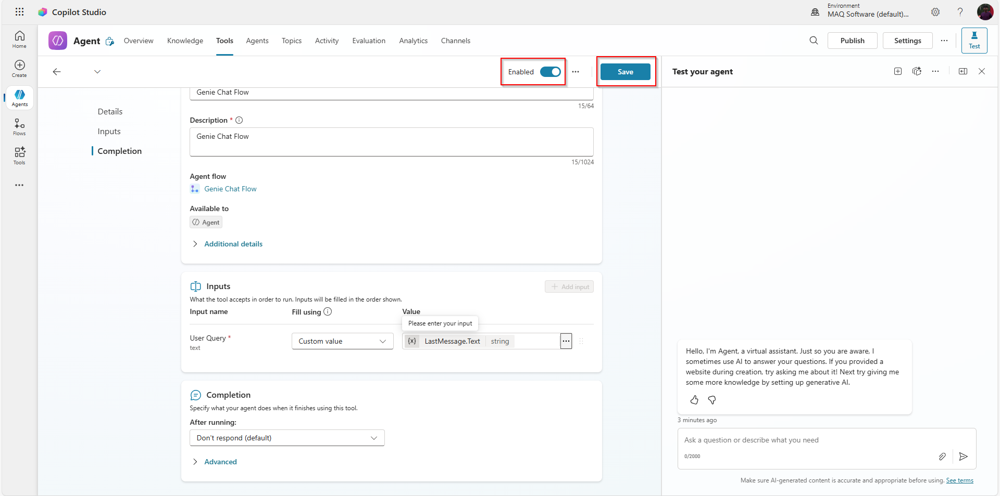 |
| 3 | After saving, test the bot in the playground. | 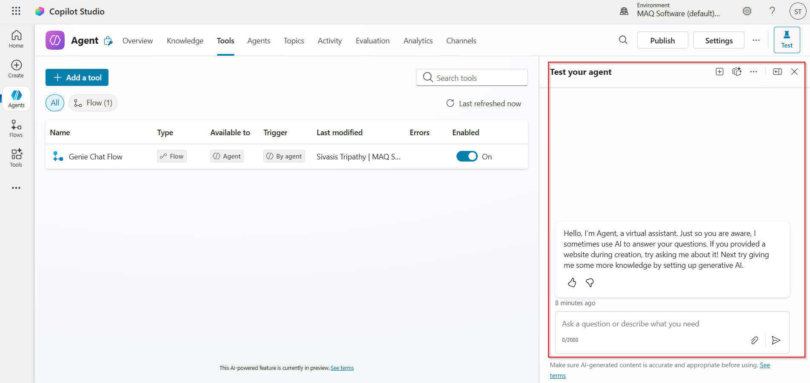 |

## Publish to Teams

| Step | Description | Screenshot |
|------|-------------|------------|
| 1 | After testing, click on the **Publish** button (top right corner). | 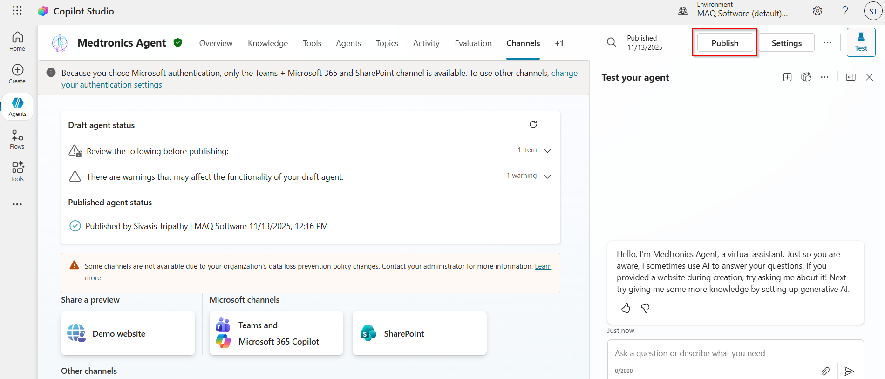 |
| 2 | Click on the **Publish** button again. | 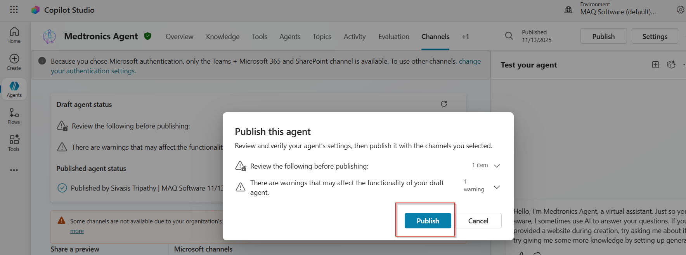 |
| 3 | Once Published, navigate to the Channels tab and click on the **Microsoft channels** button. | 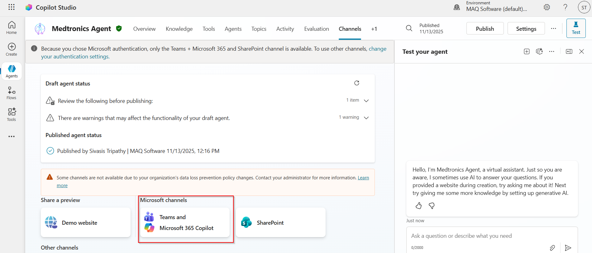 |
| 4 | Click on **See agent in Teams**. | 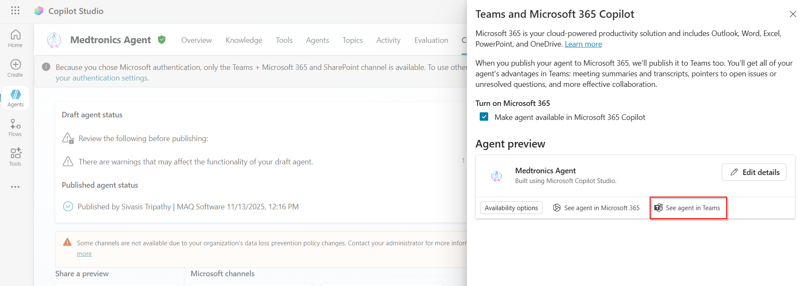 |